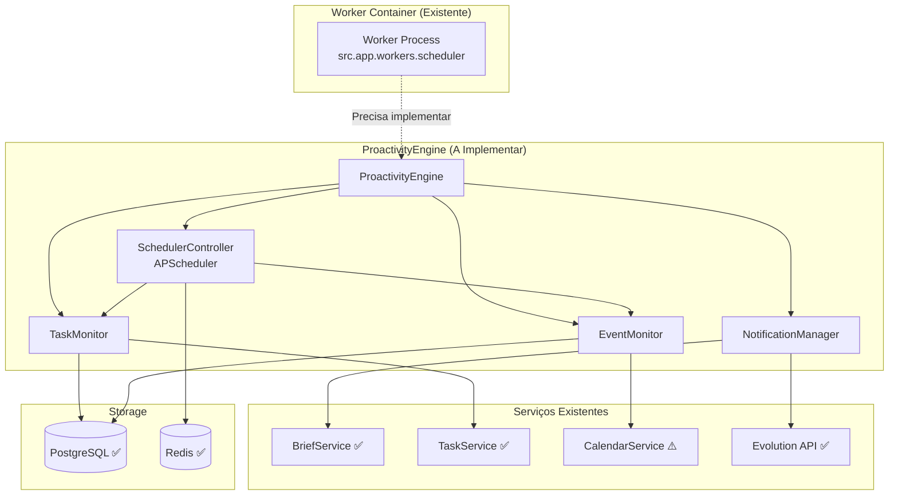

# ADR RF-015: ProactivityEngine Implementation

**Status**: 🔴 NÃO IMPLEMENTADO (P0 Blocked)
**Data**: 2025-10-04
**Decisor**: Claude Code (Phase 4 Orchestrator)
**Contexto**: Phase 4 P0 Requirements - Operational Implementation

---

## 📋 Contexto

O requisito **RF-015** define a implementação do **ProactivityEngine**, componente crítico P0 que transformará o SparkOne de um assistente reativo em um agente proativo.

### Objetivos do ProactivityEngine

1. **Brief Diário Automático**: Enviar resumo matinal das tarefas e eventos
2. **Lembretes de Tarefas**: Notificar usuário quando deadline se aproxima
3. **Lembretes de Eventos**: Alertar sobre eventos próximos
4. **Notificações Inteligentes**: Sistema proativo de notificações via WhatsApp

---

## 🎯 Requisitos Funcionais

### RF-015: ProactivityEngine para Lembretes Automáticos

**Prioridade**: P0 (Crítico)
**Trace ID**: RF-015
**ADRs Relacionados**: ADR-007 (APScheduler), ADR-008 (Worker Container)
**Dependências**:
- Worker Container ✅ (já configurado)
- APScheduler ❌ (não instalado)
- Evolution API ✅ (já integrado)

**Critérios de Aceitação (Gherkin):**

```gherkin
Feature: ProactivityEngine - Lembretes Automáticos
  Como usuário do SparkOne
  Quero receber lembretes automáticos e briefs diários
  Para manter-me organizado sem precisar solicitar

  Scenario: Brief diário automático
    Given que são 08:00 da manhã
    When o ProactivityEngine executa o scheduler diário
    Then um brief estruturado deve ser gerado
    And o brief deve ser enviado via WhatsApp
    And o log de execução deve ser registrado

  Scenario: Lembrete de tarefa próxima ao vencimento
    Given que existe uma tarefa com deadline em 2 horas
    When o ProactivityEngine verifica tarefas pendentes
    Then um lembrete deve ser enviado via WhatsApp
    And a tarefa deve ser marcada como "lembrete_enviado"

  Scenario: Lembrete de evento próximo
    Given que existe um evento começando em 30 minutos
    When o ProactivityEngine verifica eventos próximos
    Then uma notificação deve ser enviada
    And o evento deve incluir detalhes de localização se disponível
```

---

## 🏗️ Arquitetura Proposta

### Componentes do ProactivityEngine

```
src/
├── app/services/
│   ├── proactivity_engine.py      # ❌ Core do motor de proatividade
│   ├── scheduler_controller.py    # ❌ Gerenciamento APScheduler
│   ├── notification_manager.py    # ❌ Multi-channel notifications
│   ├── task_monitor.py           # ❌ Monitoramento de deadlines
│   └── event_monitor.py          # ❌ Monitoramento de eventos
│
├── worker/
│   ├── main.py                   # ⚠️ Existe mas sem lógica ProactivityEngine
│   ├── jobs/
│   │   ├── daily_brief.py        # ❌ Job de brief diário
│   │   ├── task_reminders.py     # ❌ Job de lembretes de tarefas
│   │   └── event_reminders.py    # ❌ Job de lembretes de eventos
│   └── config.py                 # ❌ Configuração específica do worker
│
└── app/models/
    ├── job_execution.py          # ❌ Histórico de execuções
    └── notification_log.py       # ❌ Log de notificações
```

### Fluxo de Execução



---

## 📊 Estado Atual vs Desejado

### Estado Atual (2025-10-04)

| Componente | Status | Observações |
|------------|--------|-------------|
| **Worker Container** | ✅ Configurado | `docker-compose.prod.yml:77-90` |
| **Worker Process** | ⚠️ Básico | Executa `src.app.workers.scheduler` |
| **APScheduler** | ❌ Não instalado | Dependency missing |
| **ProactivityEngine** | ❌ Não existe | Core logic missing |
| **SchedulerController** | ❌ Não existe | - |
| **NotificationManager** | ❌ Não existe | - |
| **TaskMonitor** | ❌ Não existe | - |
| **EventMonitor** | ❌ Não existe | - |
| **BriefService** | ✅ Implementado | `src/app/routers/brief.py` |
| **Evolution API** | ✅ Integrado | `src/app/providers/evolution_api.py` |
| **Redis** | ✅ Rodando | Para job queue |
| **PostgreSQL** | ⚠️ External | Usa DB externo |

### Gaps Identificados

#### 🔴 Crítico - Bloqueadores P0

1. **ProactivityEngine Core** não existe
   - Arquivo: `src/app/services/proactivity_engine.py`
   - Esforço estimado: 8h
   - Impacto: Bloqueador total

2. **APScheduler** não instalado
   - Dependency: `apscheduler>=3.10.0`
   - Esforço: 2h (instalação + configuração)
   - Impacto: Bloqueador para scheduling

3. **Jobs de Proatividade** não existem
   - Arquivos: `src/worker/jobs/*.py`
   - Esforço estimado: 12h
   - Impacto: Sem funcionalidade proativa

4. **NotificationManager** não existe
   - Arquivo: `src/app/services/notification_manager.py`
   - Esforço estimado: 6h
   - Impacto: Sem envio de notificações proativas

#### ⚠️ Importante - Melhorias Necessárias

5. **CalendarService** incompleto
   - Status: Parcialmente implementado
   - Precisa: Integração com Google Calendar
   - Esforço estimado: 8h

6. **Monitoring/Observability**
   - Prometheus configurado ✅
   - Grafana configurado ✅
   - Métricas ProactivityEngine ❌
   - Esforço estimado: 4h

---

## 🚀 Plano de Implementação

### Fase 1: Fundação (Dias 1-2)

#### Task 1.1: Instalar e Configurar APScheduler
```bash
# Adicionar ao requirements.txt
apscheduler>=3.10.0
sqlalchemy>=2.0.0  # Para JobStore persistente
```

**Configuração mínima:**
```python
# src/app/core/scheduler_config.py
from apscheduler.schedulers.asyncio import AsyncIOScheduler
from apscheduler.jobstores.sqlalchemy import SQLAlchemyJobStore

jobstores = {
    'default': SQLAlchemyJobStore(url=settings.DATABASE_URL)
}

scheduler = AsyncIOScheduler(jobstores=jobstores, timezone='America/Sao_Paulo')
```

#### Task 1.2: Implementar ProactivityEngine Core
```python
# src/app/services/proactivity_engine.py
class ProactivityEngine:
    def __init__(self):
        self.scheduler = scheduler
        self.notification_manager = NotificationManager()
        self.task_monitor = TaskMonitor()
        self.event_monitor = EventMonitor()

    async def start(self):
        """Inicializa o motor de proatividade"""
        await self._configure_daily_brief()
        await self._configure_task_monitoring()
        await self._configure_event_monitoring()
        self.scheduler.start()

    async def _configure_daily_brief(self):
        """Configura brief diário às 08:00"""
        self.scheduler.add_job(
            func=self._send_daily_brief,
            trigger='cron',
            hour=8,
            minute=0,
            id='daily_brief',
            replace_existing=True
        )
```

### Fase 2: Notificações (Dias 3-4)

#### Task 2.1: Implementar NotificationManager
```python
# src/app/services/notification_manager.py
class NotificationManager:
    async def send_whatsapp(self, to: str, message: str):
        """Envia notificação via WhatsApp"""
        # Integrar com Evolution API existente

    async def log_notification(self, notification_type, recipient, status):
        """Registra histórico de notificações"""
```

#### Task 2.2: Implementar Daily Brief Job
```python
# src/worker/jobs/daily_brief.py
async def generate_and_send_daily_brief():
    """Gera e envia brief diário"""
    # 1. Buscar tarefas do dia
    # 2. Buscar eventos próximos
    # 3. Gerar brief estruturado
    # 4. Enviar via NotificationManager
```

### Fase 3: Monitoramento (Dias 5-6)

#### Task 3.1: Implementar TaskMonitor
```python
# src/app/services/task_monitor.py
class TaskMonitor:
    async def check_upcoming_deadlines(self):
        """Verifica tarefas próximas ao deadline"""
        # Query tasks com deadline < 2 horas
        # Enviar lembretes via NotificationManager
```

#### Task 3.2: Implementar EventMonitor
```python
# src/app/services/event_monitor.py
class EventMonitor:
    async def check_upcoming_events(self):
        """Verifica eventos próximos"""
        # Query eventos começando em < 30 minutos
        # Enviar notificações via NotificationManager
```

### Fase 4: Integração e Testes (Dias 7-8)

#### Task 4.1: Integrar no Worker Container
```python
# src/worker/main.py
from src.app.services.proactivity_engine import ProactivityEngine

async def main():
    engine = ProactivityEngine()
    await engine.start()

    # Keep running
    await asyncio.Event().wait()
```

#### Task 4.2: Testes E2E
```python
# tests/integration/test_proactivity_engine.py
async def test_daily_brief_execution():
    """Testa execução do brief diário"""
    # Simular horário 08:00
    # Verificar que brief foi gerado e enviado
```

---

## ⚙️ Configuração Necessária

### Variáveis de Ambiente

Adicionar ao `.env`:
```bash
# ProactivityEngine Configuration
WORKER_ENABLED=true
SCHEDULER_TIMEZONE=America/Sao_Paulo
DAILY_BRIEF_TIME=08:00
TASK_REMINDER_ADVANCE_HOURS=2
EVENT_REMINDER_ADVANCE_MINUTES=30

# Notification Configuration
NOTIFICATION_RATE_LIMIT_PER_HOUR=60
NOTIFICATION_RETRY_ATTEMPTS=3
NOTIFICATION_RETRY_DELAY_SECONDS=30
```

### Docker Compose (Já Configurado ✅)

```yaml
# docker-compose.prod.yml (linhas 77-90)
worker:
  build: .
  command: python -m src.app.workers.scheduler  # ⚠️ Precisa atualizar
  env_file: .env
  environment:
    - TZ=${TZ:-America/Sao_Paulo}
  depends_on:
    - redis
  networks:
    - sparkone-network
  restart: unless-stopped
```

**Sugestão de Atualização:**
```yaml
worker:
  build: .
  command: python -m src.worker.main  # Novo entry point
  env_file: .env
  environment:
    - TZ=${TZ:-America/Sao_Paulo}
    - WORKER_ENABLED=true
  depends_on:
    - redis
  healthcheck:  # Adicionar healthcheck
    test: ["CMD", "python", "-c", "import sys; sys.exit(0)"]
    interval: 60s
    timeout: 10s
    retries: 3
  networks:
    - sparkone-network
  restart: unless-stopped
```

---

## 📊 Métricas de Sucesso

### KPIs Técnicos
- **Uptime do Worker**: > 99%
- **Latência de Notificação**: < 30 segundos
- **Taxa de Entrega**: > 95%
- **Jobs Executados com Sucesso**: > 99%

### KPIs de Negócio
- **Briefs Diários Enviados**: 100% dos dias úteis
- **Lembretes de Tarefa**: > 90% das tarefas próximas ao deadline
- **Satisfação do Usuário**: Feedback positivo

### Prometheus Metrics (A Implementar)

```python
# Métricas a adicionar
from prometheus_client import Counter, Histogram, Gauge

proactivity_jobs_total = Counter(
    'proactivity_jobs_total',
    'Total de jobs do ProactivityEngine executados',
    ['job_type', 'status']
)

proactivity_notification_duration = Histogram(
    'proactivity_notification_duration_seconds',
    'Tempo para enviar notificação',
    ['channel']
)

proactivity_active_schedules = Gauge(
    'proactivity_active_schedules',
    'Número de schedules ativos'
)
```

---

## 🚨 Riscos e Mitigações

### R1: Complexidade de Implementação
- **Impacto**: Alto
- **Probabilidade**: Média
- **Mitigação**: Implementação incremental, testes contínuos

### R2: Dependência da Evolution API
- **Impacto**: Alto
- **Probabilidade**: Média
- **Mitigação**: Retry logic, fallback para logs

### R3: Timezone e Horários
- **Impacto**: Médio
- **Probabilidade**: Média
- **Mitigação**: Testes extensivos, configuração explícita de TZ

### R4: Sobrecarga de Notificações
- **Impacto**: Médio
- **Probabilidade**: Baixa
- **Mitigação**: Rate limiting rigoroso

---

## ✅ Checklist de Implementação

### Dependências
- [ ] Instalar APScheduler (`apscheduler>=3.10.0`)
- [ ] Configurar JobStore no PostgreSQL
- [ ] Configurar timezone do scheduler

### Core Services
- [ ] Implementar `ProactivityEngine`
- [ ] Implementar `SchedulerController`
- [ ] Implementar `NotificationManager`
- [ ] Implementar `TaskMonitor`
- [ ] Implementar `EventMonitor`

### Jobs
- [ ] Implementar `daily_brief.py`
- [ ] Implementar `task_reminders.py`
- [ ] Implementar `event_reminders.py`

### Models
- [ ] Criar `JobExecution` model
- [ ] Criar `NotificationLog` model
- [ ] Criar migrations

### Worker
- [ ] Atualizar `src/worker/main.py`
- [ ] Configurar entry point no Docker
- [ ] Adicionar healthcheck

### Testes
- [ ] Testes unitários (>80% coverage)
- [ ] Testes de integração
- [ ] Testes E2E

### Observability
- [ ] Adicionar métricas Prometheus
- [ ] Configurar alertas
- [ ] Criar dashboard Grafana

### Documentação
- [ ] Atualizar README.md
- [ ] Documentar configuração
- [ ] Criar runbooks

---

## 📚 Referências

- **Execution Plan**: `/docs/prd/sparkone/execution_plan_proactivity.md`
- **PRD**: `/docs/prd/sparkone/PRD.pt-BR.md`
- **Docker Compose**: `/docker-compose.prod.yml`
- **APScheduler Docs**: https://apscheduler.readthedocs.io/
- **Evolution API**: https://doc.evolution-api.com/

---

## 🎯 Próximos Passos Imediatos

1. ✅ Documentação criada (este ADR)
2. ❌ Instalar APScheduler
3. ❌ Implementar ProactivityEngine core
4. ❌ Implementar NotificationManager
5. ❌ Criar jobs de proatividade
6. ❌ Testes de integração
7. ❌ Deploy e validação

---

**Status Final**: 🔴 **BLOQUEADO** - Requer implementação substancial de código
**Esforço Estimado**: 40-50 horas de desenvolvimento
**Prioridade**: P0 (Crítico para funcionalidade proativa)
**Bloqueador**: Falta implementação de todos os componentes core

**Recomendação**: Alocar sprint dedicado (8-10 dias) para implementação completa do ProactivityEngine conforme execution_plan_proactivity.md

---

**Criado por**: Claude Code (Phase 4 Orchestrator)
**Data**: 2025-10-04
**Versão**: 1.0
