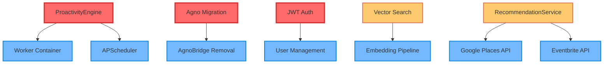

# Matriz de Coerência - SparkOne
## Análise de Consistência e Lacunas do Projeto

**Versão:** 1.0  
**Data:** Janeiro 2025  
**Objetivo:** Identificar inconsistências, lacunas e pontos de atenção no projeto SparkOne  

---

## Metodologia de Avaliação

### **Critérios de Classificação**

| Status | Significado | Descrição |
|--------|-------------|-----------|
| ✅ **Faz Sentido** | Consistente e bem implementado | Componente alinhado com objetivos, bem documentado e funcional |
| ⚠️ **Não Faz Sentido** | Inconsistente ou problemático | Componente com problemas de design, implementação ou alinhamento |
| ❓ **Desconhecido** | Informação insuficiente | Necessita investigação adicional ou documentação |

### **Dimensões Analisadas**
- **Alinhamento Estratégico:** Componente alinha com visão do SparkOne?
- **Implementação Técnica:** Código está bem estruturado e funcional?
- **Documentação:** Componente está adequadamente documentado?
- **Dependências:** Dependências estão claras e gerenciadas?
- **Manutenibilidade:** Código é fácil de manter e evoluir?

### **Convenção de IDs**
Todos os requisitos são referenciados por IDs padronizados e bilíngues: RF-xxx (funcionais) e RNF-xxx (não funcionais). Os mesmos IDs se aplicam aos PRDs PT e EN.

---

## Matriz de Coerência por Componente

### **🏗️ Arquitetura e Infraestrutura**

| Componente | Status | Alinhamento | Implementação | Documentação | Observações |
|------------|--------|-------------|---------------|--------------|-------------|
| **FastAPI Framework** | ✅ | ✅ | ✅ | ✅ | Escolha sólida, bem implementado, documentação completa |
| **PostgreSQL + pgvector** | ✅ | ✅ | ✅ | ✅ | Excelente para IA, suporte a vetores implementado |
| **Redis Cache/Rate Limit** | ✅ | ✅ | ✅ | ✅ | Uso apropriado, configuração adequada |
| **Docker Compose** | ✅ | ✅ | ✅ | ✅ | Setup local funcional, serviços bem definidos |
| **Middleware Stack** | ✅ | ✅ | ✅ | ⚠️ | Implementação sólida, documentação poderia ser melhor |
| **SQLite Fallback** | ✅ | ✅ | ✅ | ✅ | Boa estratégia para desenvolvimento local |

### **🤖 Orquestração e IA**

| Componente | Status | Alinhamento | Implementação | Documentação | Observações |
|------------|--------|-------------|---------------|--------------|-------------|
| **AgnoBridge** | ⚠️ | ✅ | ⚠️ | ✅ | Solução temporária, mas funcional. Migração para Agno necessária |
| **Message Classification** | ✅ | ✅ | ✅ | ✅ | Classificação em 5 tipos funciona bem |
| **LLM Integration (OpenAI)** | ✅ | ✅ | ✅ | ✅ | Integração sólida, configuração flexível |
| **Agno Library Migration** | ❓ | ✅ | ❓ | ⚠️ | Planejado mas não iniciado, dependência externa |
| **Vector Search** | ⚠️ | ✅ | ⚠️ | ⚠️ | Infraestrutura pronta, mas não utilizada |

### **🔧 Serviços de Domínio**

| Componente | Status | Alinhamento | Implementação | Documentação | Observações |
|------------|--------|-------------|---------------|--------------|-------------|
| **TaskService** | ✅ | ✅ | ✅ | ✅ | Implementação completa, sync Notion funcional |
| **CalendarService** | ✅ | ✅ | ✅ | ✅ | Suporte CalDAV e Google Calendar implementado |
| **PersonalCoachService** | ✅ | ✅ | ✅ | ✅ | Funcionalidade bem definida e implementada |
| **BriefService** | ✅ | ✅ | ✅ | ✅ | Resumos estruturados funcionais |
| **ProactivityEngine** | ⚠️ | ✅ | ⚠️ | ✅ | **CRÍTICO:** Não implementado, mas essencial para visão |
| **RecommendationService** | ⚠️ | ✅ | ⚠️ | ✅ | Planejado mas não implementado, APIs identificadas |

### **🔗 Integrações Externas**

| Componente | Status | Alinhamento | Implementação | Documentação | Observações |
|------------|--------|-------------|---------------|--------------|-------------|
| **Notion API** | ✅ | ✅ | ✅ | ✅ | Integração sólida, sync bidirecional |
| **Evolution API (WhatsApp)** | ✅ | ✅ | ✅ | ✅ | Canal principal funcionando bem |
| **Google Calendar** | ✅ | ✅ | ✅ | ✅ | OAuth2 configurado, sync funcional |
| **CalDAV Protocol** | ✅ | ✅ | ✅ | ✅ | Suporte Apple Calendar implementado |
| **Google Sheets** | ✅ | ✅ | ✅ | ⚠️ | Funcional, mas documentação limitada |
| **Google Places API** | ❓ | ✅ | ❓ | ⚠️ | Planejado para RecommendationService |
| **Eventbrite API** | ❓ | ✅ | ❓ | ⚠️ | Planejado para RecommendationService |

### **🛡️ Segurança e Autenticação**

| Componente | Status | Alinhamento | Implementação | Documentação | Observações |
|------------|--------|-------------|---------------|--------------|-------------|
| **HTTP Basic Auth** | ⚠️ | ⚠️ | ✅ | ✅ | Funcional mas limitado, JWT seria melhor |
| **Security Headers** | ✅ | ✅ | ✅ | ✅ | CSP, HSTS, XSS protection implementados |
| **Rate Limiting** | ✅ | ✅ | ✅ | ✅ | Redis-based, configuração adequada |
| **CORS Policy** | ✅ | ✅ | ✅ | ✅ | Configuração apropriada para desenvolvimento |
| **Secrets Management** | ⚠️ | ✅ | ⚠️ | ✅ | .env funcional, mas não ideal para produção |
| **JWT Authentication** | ⚠️ | ✅ | ⚠️ | ⚠️ | Não implementado, necessário para escalabilidade |

### **📊 Monitoramento e Observabilidade**

| Componente | Status | Alinhamento | Implementação | Documentação | Observações |
|------------|--------|-------------|---------------|--------------|-------------|
| **Prometheus Metrics** | ✅ | ✅ | ✅ | ✅ | Métricas básicas implementadas |
| **Structured Logging** | ✅ | ✅ | ✅ | ✅ | structlog com correlation IDs |
| **Health Checks** | ✅ | ✅ | ✅ | ⚠️ | Básico implementado, poderia ser mais detalhado |
| **OpenTelemetry** | ❓ | ✅ | ❓ | ⚠️ | Suporte opcional, não ativo |
| **Error Tracking** | ⚠️ | ✅ | ⚠️ | ⚠️ | Logging básico, sem ferramenta dedicada |
| **Performance Monitoring** | ⚠️ | ✅ | ⚠️ | ⚠️ | Métricas básicas, sem APM dedicado |

---

## Análise de Inconsistências Críticas

### **🚨 Problemas Críticos (P0)**

#### **1. ProactivityEngine Ausente**
- **Problema:** Componente central da visão não implementado
- **Impacto:** SparkOne não é proativo, apenas reativo
- **Solução:** Implementar APScheduler + Worker container
- **Prazo:** Sprint atual

#### **2. AgnoBridge como Solução Temporária**
- **Problema:** Dependência de solução temporária para orquestração
- **Impacto:** Possível instabilidade, limitações de funcionalidade
- **Solução:** Migrar para Agno Library oficial
- **Prazo:** Próximas 2 sprints

#### **3. Autenticação HTTP Basic**
- **Problema:** Método de autenticação inadequado para produção
- **Impacto:** Limitações de segurança e escalabilidade
- **Solução:** Implementar JWT com refresh tokens
- **Prazo:** Próximas 3 sprints

### **⚠️ Inconsistências Importantes (P1)**

#### **1. Vector Search Não Utilizado**
- **Problema:** pgvector configurado mas não usado
- **Impacto:** Capacidades de IA subutilizadas
- **Solução:** Implementar busca semântica
- **Justificativa:** Infraestrutura pronta, falta implementação

#### **2. RecommendationService Incompleto**
- **Problema:** Serviço planejado mas não implementado
- **Impacto:** Funcionalidade de recomendações ausente
- **Solução:** Integrar Google Places + Eventbrite APIs
- **Justificativa:** APIs identificadas, estrutura preparada

#### **3. Worker Container Definido mas Vazio**
- **Problema:** Container worker no docker-compose sem implementação
- **Impacto:** Tarefas assíncronas não funcionam
- **Solução:** Implementar APScheduler worker
- **Justificativa:** Infraestrutura pronta, falta código

### **❓ Lacunas de Informação**

#### **1. Agno Library Status**
- **Lacuna:** Status de desenvolvimento da biblioteca oficial
- **Impacto:** Planejamento de migração incerto
- **Ação:** Contatar equipe Agno para roadmap

#### **2. Performance Benchmarks**
- **Lacuna:** Métricas de performance não documentadas
- **Impacto:** Otimizações sem baseline
- **Ação:** Implementar benchmarking automatizado

#### **3. Estratégia de Deployment**
- **Lacuna:** Ambiente de produção não definido
- **Impacto:** Deploy strategy unclear
- **Ação:** Definir infraestrutura de produção

---

## Matriz de Dependências

### **Dependências Críticas**



### **Bloqueadores Identificados**

| Componente | Bloqueador | Tipo | Impacto | Solução |
|------------|------------|------|---------|---------|
| **Agno Migration** | Biblioteca não disponível | Externo | Alto | Aguardar release ou implementar bridge melhorado |
| **Production Deploy** | Infraestrutura não definida | Interno | Médio | Definir cloud provider e arquitetura |
| **Mobile App** | API não otimizada | Interno | Baixo | Otimizar endpoints para mobile |
| **Multi-tenant** | Schema não preparado | Interno | Baixo | Redesign database schema |

---

## Recomendações de Ação

### **Imediatas (Esta Sprint)**

1. **Implementar ProactivityEngine**
   - Prioridade: P0
   - Esforço: 8 pontos
   - Impacto: Crítico para visão do produto

2. **Configurar Worker Container**
   - Prioridade: P0
   - Esforço: 5 pontos
   - Dependência: ProactivityEngine

3. **Melhorar Error Handling**
   - Prioridade: P0
   - Esforço: 3 pontos
   - Impacto: Estabilidade

### **Curto Prazo (Próximas 2 Sprints)**

1. **Implementar Vector Search**
   - Prioridade: P1
   - Esforço: 8 pontos
   - ROI: Alto (infraestrutura já pronta)

2. **Migrar para JWT Authentication**
   - Prioridade: P1
   - Esforço: 5 pontos
   - Impacto: Segurança e escalabilidade

3. **RecommendationService MVP**
   - Prioridade: P1
   - Esforço: 13 pontos
   - Valor: Diferencial competitivo

### **Médio Prazo (Próximos 3 Meses)**

1. **Agno Library Migration**
   - Prioridade: P0
   - Esforço: 13 pontos
   - Dependência: Release da biblioteca

2. **Production Deployment**
   - Prioridade: P1
   - Esforço: 21 pontos
   - Impacto: Go-to-market

3. **Advanced Monitoring**
   - Prioridade: P1
   - Esforço: 8 pontos
   - Impacto: Operacional

---

## Métricas de Coerência

### **Score Geral do Projeto**

| Dimensão | Score | Observação |
|----------|-------|------------|
| **Alinhamento Estratégico** | 85% | Visão clara, implementação parcial |
| **Qualidade Técnica** | 78% | Código sólido, algumas lacunas |
| **Documentação** | 82% | Boa documentação, alguns gaps |
| **Manutenibilidade** | 75% | Estrutura boa, refatoração necessária |
| **Completude** | 60% | ~60% das funcionalidades implementadas |

### **Score por Categoria**

```
Arquitetura:     ████████████████████ 90%
Serviços Core:   ████████████████     80%
Integrações:     ██████████████████   85%
Segurança:       ████████████         65%
Monitoramento:   ██████████████       70%
Documentação:    ████████████████     82%
```

### **Tendência de Evolução**

- **Dezembro 2024:** 45% completo
- **Janeiro 2025:** 60% completo (+15%)
- **Meta Fevereiro:** 75% completo (+15%)
- **Meta Março:** 85% completo (+10%)

---

## Conclusões e Próximos Passos

### **Pontos Fortes Identificados**

1. **Arquitetura Sólida:** FastAPI + PostgreSQL + Redis bem implementados
2. **Integrações Funcionais:** Notion, WhatsApp, Google Calendar operacionais
3. **Segurança Básica:** Headers e rate limiting implementados
4. **Documentação Abrangente:** PRD, specs e documentação técnica completas
5. **Infraestrutura Preparada:** Docker Compose, pgvector, middleware stack

### **Lacunas Críticas**

1. **ProactivityEngine:** Componente central ausente
2. **Agno Dependency:** Dependência de solução temporária
3. **Authentication:** HTTP Basic inadequado para produção
4. **Vector Search:** Capacidade não utilizada
5. **Worker Jobs:** Container definido mas vazio

### **Estratégia de Resolução**

1. **Foco em P0:** Resolver bloqueadores críticos primeiro
2. **Aproveitar Infraestrutura:** Utilizar componentes já preparados
3. **Iteração Rápida:** Implementar MVPs antes de soluções completas
4. **Documentação Contínua:** Manter documentação atualizada
5. **Qualidade First:** Não comprometer qualidade por velocidade

---

**Matriz de Coerência mantida por:** Equipe de Arquitetura  
**Frequência de revisão:** Quinzenal  
**Próxima revisão:** Após implementação do ProactivityEngine  
**Responsável:** Arquiteto de Software Principal
