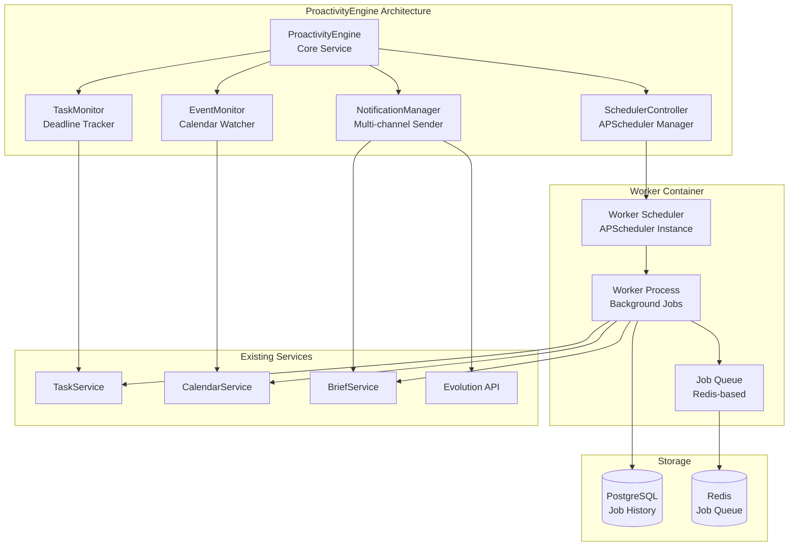

# Plano de Execução - ProactivityEngine
## SparkOne P0 Implementation Plan

**Versão:** 1.0  
**Data:** Janeiro 2025  
**Status:** Pronto para Execução  
**Baseline:** baseline_v1.md (Score: 78/100)  

---

## Resumo Executivo

O **ProactivityEngine** é o componente crítico P0 que transformará o SparkOne de um assistente reativo em um agente proativo. Este plano detalha a implementação completa em 2 sprints, focando em lembretes automáticos, briefs diários e notificações inteligentes.

### Objetivos do Plano
- ✅ Implementar o **RF-015** (ProactivityEngine) conforme PRD baseline
- ✅ Entregar funcionalidade de **Worker Container** para processamento assíncrono
- ✅ Configurar **APScheduler** para automação temporal
- ✅ Integrar com **WhatsApp** via Evolution API para notificações proativas
- ✅ Manter compatibilidade com arquitetura atual (AgnoBridge, FastAPI, PostgreSQL)

---

## Análise de Requisitos

### Requisitos Funcionais Mapeados

#### **RF-015: ProactivityEngine para lembretes automáticos**
- **Status Atual:** ❌ Não implementado
- **Prioridade:** P0 (crítico)
- **Trace ID:** RF-015
- **ADR Relacionado:** ADR-007 (APScheduler), ADR-008 (Worker Container)
- **Dependências:** Worker Container, APScheduler, Evolution API

**Critérios de Aceitação (Gherkin):**
```gherkin
Feature: ProactivityEngine - Lembretes Automáticos
  Como usuário do SparkOne
  Quero receber lembretes automáticos e briefs diários
  Para manter-me organizado sem precisar solicitar

  Scenario: Brief diário automático
    Given que são 08:00 da manhã
    When o ProactivityEngine executa o scheduler diário
    Then um brief estruturado deve ser gerado
    And o brief deve ser enviado via WhatsApp
    And o log de execução deve ser registrado

  Scenario: Lembrete de tarefa próxima ao vencimento
    Given que existe uma tarefa com deadline em 2 horas
    When o ProactivityEngine verifica tarefas pendentes
    Then um lembrete deve ser enviado via WhatsApp
    And a tarefa deve ser marcada como "lembrete_enviado"

  Scenario: Lembrete de evento próximo
    Given que existe um evento começando em 30 minutos
    When o ProactivityEngine verifica eventos próximos
    Then uma notificação deve ser enviada
    And o evento deve incluir detalhes de localização se disponível
```

### Dependências Identificadas

#### **Worker Container** (Novo Componente)
- **Trace ID:** INFRA-001
- **Prioridade:** P0 (bloqueador para ProactivityEngine)
- **Descrição:** Container separado para processamento assíncrono
- **Justificativa:** Separar responsabilidades entre API (síncrona) e processamento (assíncrono)

#### **APScheduler Integration**
- **Trace ID:** INFRA-002  
- **Prioridade:** P0 (bloqueador para ProactivityEngine)
- **Descrição:** Configuração de scheduler para tarefas recorrentes
- **Justificativa:** Automação temporal para briefs e lembretes

#### **Evolution API Enhancement**
- **Trace ID:** INT-001
- **Prioridade:** P0 (bloqueador para notificações)
- **Descrição:** Melhorar integração para envio proativo de mensagens
- **Justificativa:** Canal principal para notificações proativas

---

## Arquitetura Proposta

### Visão Geral do ProactivityEngine



### Componentes Detalhados

#### **1. ProactivityEngine (Core)**
- **Arquivo:** `src/app/services/proactivity_engine.py`
- **Responsabilidades:**
  - Coordenar monitoramento de tarefas e eventos
  - Gerenciar políticas de notificação
  - Integrar com serviços existentes
  - Configurar schedules automáticos

#### **2. Worker Container**
- **Arquivo:** `src/worker/main.py`
- **Responsabilidades:**
  - Executar jobs assíncronos
  - Processar schedules do APScheduler
  - Enviar notificações via Evolution API
  - Registrar logs de execução

#### **3. SchedulerController**
- **Arquivo:** `src/app/services/scheduler_controller.py`
- **Responsabilidades:**
  - Configurar jobs recorrentes (brief diário)
  - Gerenciar jobs dinâmicos (lembretes de deadline)
  - Monitorar execução de jobs
  - Tratar falhas e retry logic

#### **4. NotificationManager**
- **Arquivo:** `src/app/services/notification_manager.py`
- **Responsabilidades:**
  - Abstrair canais de notificação (WhatsApp, futuro: email, push)
  - Formatar mensagens por canal
  - Implementar rate limiting para notificações
  - Rastrear histórico de notificações

---

## Plano de Implementação

### **Sprint 1: Fundação e Worker Container (5 dias)**

#### **Dia 1-2: Setup do Worker Container**

**Task 1.1: Criar estrutura do Worker Container**
- **ID:** EXEC-001
- **Trace ID:** INFRA-001
- **ADR:** ADR-008
- **Esforço:** 8h
- **Arquivos:**
  - `src/worker/main.py` (novo)
  - `src/worker/config.py` (novo)
  - `src/worker/jobs/` (diretório novo)
  - `docker-compose.worker.yml` (novo)

**Critérios de Aceitação:**
```gherkin
Given que o Worker Container está configurado
When eu executo `docker-compose up worker`
Then o container deve inicializar sem erros
And deve conectar ao PostgreSQL e Redis
And deve registrar "Worker started successfully" no log
```

**Task 1.2: Configurar APScheduler no Worker**
- **ID:** EXEC-002
- **Trace ID:** INFRA-002
- **ADR:** ADR-007
- **Esforço:** 6h
- **Dependências:** EXEC-001

**Critérios de Aceitação:**
```gherkin
Given que o APScheduler está configurado
When eu adiciono um job de teste
Then o job deve ser executado no horário agendado
And o resultado deve ser persistido no PostgreSQL
And logs detalhados devem ser gerados
```

#### **Dia 3: Core do ProactivityEngine**

**Task 1.3: Implementar ProactivityEngine Service**
- **ID:** EXEC-003
- **Trace ID:** RF-015
- **ADR:** ADR-009
- **Esforço:** 8h
- **Dependências:** EXEC-001, EXEC-002

**Critérios de Aceitação:**
```gherkin
Given que o ProactivityEngine está implementado
When eu chamo `proactivity_engine.start()`
Then todos os monitores devem ser inicializados
And schedules padrão devem ser configurados
And o status deve ser "ACTIVE"
```

#### **Dia 4-5: NotificationManager e Integração**

**Task 1.4: Implementar NotificationManager**
- **ID:** EXEC-004
- **Trace ID:** INT-001
- **ADR:** ADR-010
- **Esforço:** 10h
- **Dependências:** EXEC-003

**Critérios de Aceitação:**
```gherkin
Given que o NotificationManager está implementado
When eu envio uma notificação via WhatsApp
Then a mensagem deve ser entregue via Evolution API
And o histórico deve ser registrado no PostgreSQL
And rate limiting deve ser respeitado
```

**Task 1.5: Testes de Integração Sprint 1**
- **ID:** EXEC-005
- **Trace ID:** TEST-001
- **Esforço:** 4h
- **Dependências:** EXEC-004

### **Sprint 2: Funcionalidades Proativas (5 dias)**

#### **Dia 6-7: Brief Diário Automático**

**Task 2.1: Implementar Daily Brief Job**
- **ID:** EXEC-006
- **Trace ID:** RF-015.1
- **ADR:** ADR-009
- **Esforço:** 8h
- **Dependências:** EXEC-005

**Critérios de Aceitação:**
```gherkin
Given que são 08:00 de uma segunda-feira
When o Daily Brief Job executa
Then um brief estruturado deve ser gerado
And deve incluir tarefas do dia e eventos próximos
And deve ser enviado via WhatsApp
And o log deve registrar "Daily brief sent successfully"
```

#### **Dia 8: Monitoramento de Tarefas**

**Task 2.2: Implementar TaskMonitor**
- **ID:** EXEC-007
- **Trace ID:** RF-015.2
- **ADR:** ADR-009
- **Esforço:** 8h
- **Dependências:** EXEC-006

**Critérios de Aceitação:**
```gherkin
Given que existe uma tarefa com deadline em 2 horas
When o TaskMonitor executa verificação
Then um lembrete deve ser enviado
And a tarefa deve ser marcada como "reminder_sent"
And não deve enviar lembretes duplicados
```

#### **Dia 9: Monitoramento de Eventos**

**Task 2.3: Implementar EventMonitor**
- **ID:** EXEC-008
- **Trace ID:** RF-015.3
- **ADR:** ADR-009
- **Esforço:** 8h
- **Dependências:** EXEC-007

**Critérios de Aceitação:**
```gherkin
Given que existe um evento começando em 30 minutos
When o EventMonitor executa verificação
Then uma notificação deve ser enviada
And deve incluir detalhes de localização se disponível
And deve respeitar configurações de antecedência do usuário
```

#### **Dia 10: Testes Finais e Documentação**

**Task 2.4: Testes End-to-End**
- **ID:** EXEC-009
- **Trace ID:** TEST-002
- **Esforço:** 6h
- **Dependências:** EXEC-008

**Task 2.5: Documentação e Deploy**
- **ID:** EXEC-010
- **Trace ID:** DOC-001
- **Esforço:** 2h
- **Dependências:** EXEC-009

---

## Estrutura de Arquivos

### Novos Arquivos a Criar

```
src/
├── worker/
│   ├── main.py                    # Worker container entry point
│   ├── config.py                  # Worker-specific configuration
│   ├── jobs/
│   │   ├── __init__.py
│   │   ├── daily_brief.py         # Daily brief job
│   │   ├── task_reminders.py      # Task deadline monitoring
│   │   └── event_reminders.py     # Event proximity monitoring
│   └── utils/
│       ├── __init__.py
│       └── job_logger.py          # Job execution logging
│
├── app/services/
│   ├── proactivity_engine.py      # Core ProactivityEngine
│   ├── scheduler_controller.py    # APScheduler management
│   ├── notification_manager.py    # Multi-channel notifications
│   ├── task_monitor.py           # Task deadline monitoring
│   └── event_monitor.py          # Event proximity monitoring
│
├── app/models/
│   ├── job_execution.py          # Job execution history model
│   └── notification_log.py       # Notification history model
│
└── docker/
    └── worker.Dockerfile          # Worker container image
```

### Arquivos a Modificar

```
docker-compose.yml                 # Add worker service
src/app/main.py                   # Add ProactivityEngine startup
src/app/core/config.py            # Add worker configuration
requirements.txt                  # Add APScheduler dependency
```

---

## Configuração e Deployment

### Variáveis de Ambiente Necessárias

```bash
# Worker Configuration
WORKER_ENABLED=true
WORKER_CONCURRENCY=4
WORKER_LOG_LEVEL=INFO

# Scheduler Configuration
SCHEDULER_TIMEZONE=America/Sao_Paulo
DAILY_BRIEF_TIME=08:00
TASK_REMINDER_ADVANCE_HOURS=2
EVENT_REMINDER_ADVANCE_MINUTES=30

# Notification Configuration
NOTIFICATION_RATE_LIMIT_PER_HOUR=60
NOTIFICATION_RETRY_ATTEMPTS=3
NOTIFICATION_RETRY_DELAY_SECONDS=30
```

### Docker Compose Enhancement

```yaml
# docker-compose.yml (addition)
services:
  worker:
    build:
      context: .
      dockerfile: docker/worker.Dockerfile
    environment:
      - DATABASE_URL=${DATABASE_URL}
      - REDIS_URL=${REDIS_URL}
      - EVOLUTION_API_URL=${EVOLUTION_API_URL}
      - EVOLUTION_API_KEY=${EVOLUTION_API_KEY}
      - WORKER_ENABLED=true
    depends_on:
      - postgres
      - redis
    volumes:
      - ./src:/app/src
    restart: unless-stopped
```

---

## Testes e Validação

### Estratégia de Testes

#### **Testes Unitários**
- **Cobertura Mínima:** 80%
- **Foco:** Lógica de negócio do ProactivityEngine
- **Ferramentas:** pytest, pytest-asyncio
- **Arquivos:** `tests/services/test_proactivity_engine.py`

#### **Testes de Integração**
- **Foco:** Integração Worker ↔ API ↔ Evolution API
- **Cenários:** Brief diário, lembretes de tarefa, notificações de evento
- **Ferramentas:** pytest, testcontainers

#### **Testes End-to-End**
- **Foco:** Fluxo completo de notificação proativa
- **Cenários:** Usuário recebe brief diário no WhatsApp
- **Ferramentas:** pytest, mock Evolution API

### Critérios de Aceitação Finais

```gherkin
Feature: ProactivityEngine - Validação Final
  Como Product Owner
  Quero validar que o ProactivityEngine está funcionando completamente
  Para aprovar o deployment em produção

  Scenario: Sistema proativo funcionando
    Given que o ProactivityEngine está ativo há 24 horas
    When eu verifico os logs de execução
    Then deve haver pelo menos 1 brief diário enviado
    And deve haver pelo menos 1 lembrete de tarefa (se aplicável)
    And não deve haver erros críticos nos logs
    And todas as notificações devem ter sido entregues via WhatsApp

  Scenario: Monitoramento e observabilidade
    Given que o ProactivityEngine está executando
    When eu acesso as métricas do sistema
    Then deve haver métricas de jobs executados
    And deve haver métricas de notificações enviadas
    And deve haver alertas configurados para falhas
```

---

## Riscos e Mitigações

### Riscos Identificados

#### **R1: Dependência da Evolution API**
- **Probabilidade:** Média
- **Impacto:** Alto
- **Mitigação:** Implementar retry logic e fallback para logs quando API falhar

#### **R2: Sobrecarga de Notificações**
- **Probabilidade:** Média
- **Impacto:** Médio
- **Mitigação:** Rate limiting rigoroso e configurações de usuário para frequência

#### **R3: Falhas no Worker Container**
- **Probabilidade:** Baixa
- **Impacto:** Alto
- **Mitigação:** Health checks, restart automático, monitoramento de jobs perdidos

#### **R4: Timezone e Horários Incorretos**
- **Probabilidade:** Média
- **Impacto:** Médio
- **Mitigação:** Testes extensivos com diferentes timezones, configuração explícita

### Plano de Rollback

1. **Desabilitar Worker Container** via `WORKER_ENABLED=false`
2. **Manter API funcionando** normalmente (modo reativo)
3. **Preservar dados** de jobs executados para análise
4. **Rollback de código** via Git se necessário

---

## Métricas de Sucesso

### KPIs Técnicos
- **Uptime do Worker:** > 99%
- **Latência de Notificação:** < 30 segundos
- **Taxa de Entrega:** > 95%
- **Cobertura de Testes:** > 80%

### KPIs de Negócio
- **Briefs Diários Enviados:** 100% dos dias úteis
- **Lembretes de Tarefa:** > 90% das tarefas próximas ao deadline
- **Satisfação do Usuário:** Feedback positivo sobre proatividade

### Monitoramento
- **Logs Estruturados:** Todos os jobs com correlation ID
- **Métricas Prometheus:** Jobs executados, falhas, latência
- **Alertas:** Falhas consecutivas, API indisponível, worker down

---

## Próximos Passos

### Pós-Implementação (P1)
1. **Migração para Agno Library** (substituir AgnoBridge)
2. **Implementação de Vector Search** (pgvector)
3. **Autenticação JWT** (substituir HTTP Basic)
4. **Dashboard de Analytics** para métricas de proatividade

### Melhorias Futuras (P2)
1. **Machine Learning** para otimizar horários de notificação
2. **Múltiplos Canais** (email, push notifications)
3. **Personalização Avançada** de frequência e tipos de lembrete
4. **Integração com Google Assistant/Alexa**

---

**Documento Preparado por:** Execution Agent  
**Baseado em:** PRD Baseline v1.0 (Score: 78/100)  
**Próxima Revisão:** Após Sprint 1 (5 dias úteis)