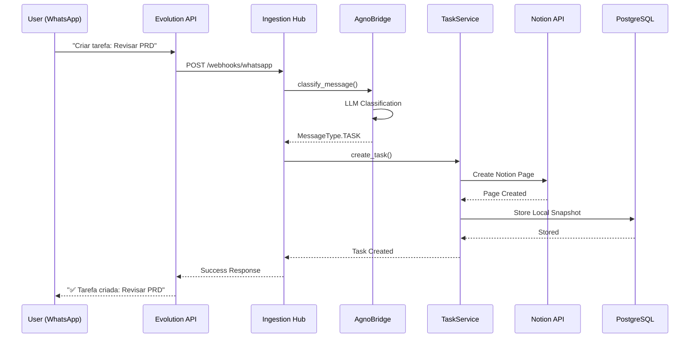

# System Map - SparkOne
## Arquitetura Atual e Fluxo de Dados

**Versão:** 1.1
**Data:** Outubro 2025
**Status:** Desenvolvimento Avançado (~85% completo)  

---

## Visão Geral da Arquitetura

```mermaid
graph TB
    %% Canais de Entrada
    subgraph "Canais de Entrada"
        WA[WhatsApp<br/>Evolution API]
        GS[Google Sheets]
        WEB[Interface Web<br/>/web]
        API[API REST<br/>Direta]
    end

    %% Ingestion Hub
    subgraph "Ingestion Hub"
        IH[/ingest<br/>Ponto Central]
        WH[/webhooks/whatsapp<br/>Webhook Handler]
    end

    %% Orquestração
    subgraph "Orquestração"
        AB[AgnoBridge<br/>Classificador LLM]
        MT{MessageType<br/>Classifier}
    end

    %% Serviços de Domínio
    subgraph "Serviços de Domínio"
        TS[TaskService<br/>Multi-Storage]
        CS[CalendarService<br/>CalDAV/Google]
        PCS[PersonalCoachService<br/>LLM Coaching]
        BS[BriefService<br/>Daily Summary]
        PE[ProactivityEngine<br/>Auto Reminders]
        RS[RecommendationService<br/>🚧 Não Implementado]
    end

    %% Storage Adapter Pattern
    subgraph "Storage Adapters"
        SAR[StorageAdapterRegistry<br/>Dynamic Registry]
        NA[NotionAdapter]
        CA[ClickUpAdapter]
        SA[SheetsAdapter]
    end

    %% Worker Process
    subgraph "Background Worker"
        WK[APScheduler<br/>Jobs Engine]
        JB1[Daily Brief Job]
        JB2[Deadline Reminders]
        JB3[Overdue Check]
        JB4[Event Reminders]
    end

    %% Integrações Externas
    subgraph "Integrações Externas"
        NOTION[Notion API<br/>Task Management]
        CLICKUP[ClickUp API<br/>Task Management]
        GSHEETS[Google Sheets API<br/>Data Import]
        GCAL[Google Calendar<br/>Event Sync]
        CALDAV[CalDAV<br/>Apple Calendar]
        OPENAI[OpenAI API<br/>LLM Provider]
        EVOL[Evolution API<br/>WhatsApp Gateway]
    end

    %% Persistência
    subgraph "Persistência"
        PG[(PostgreSQL<br/>+ pgvector)]
        REDIS[(Redis<br/>Cache + Rate Limit)]
        SQLITE[(SQLite<br/>Fallback Local)]
    end

    %% Middleware Stack
    subgraph "Middleware Stack"
        CORS[CORS Policy]
        SEC[Security Headers]
        RATE[Rate Limiting]
        PROM[Prometheus Metrics]
        CORR[Correlation ID]
        LOG[Security Logging]
    end

    %% Fluxo Principal
    WA --> WH
    GS --> IH
    WEB --> IH
    API --> IH
    WH --> IH
    
    IH --> AB
    AB --> MT
    
    MT -->|TASK| TS
    MT -->|CALENDAR| CS
    MT -->|COACH| PCS
    MT -->|BRIEF| BS
    MT -->|GENERAL| BS

    TS --> SAR
    SAR --> NA
    SAR --> CA
    SAR --> SA

    NA <--> NOTION
    CA <--> CLICKUP
    SA <--> GSHEETS
    CS <--> GCAL
    CS <--> CALDAV
    PCS --> OPENAI
    AB --> OPENAI

    %% Worker connections
    WK --> JB1
    WK --> JB2
    WK --> JB3
    WK --> JB4
    PE --> WK
    JB1 --> EVOL
    JB2 --> EVOL
    JB3 --> EVOL
    JB4 --> EVOL
    
    TS --> PG
    CS --> PG
    PCS --> PG
    BS --> PG
    
    RATE --> REDIS
    TS --> REDIS
    CS --> REDIS
    
    %% Middleware aplicado a todos os requests
    CORS -.-> IH
    SEC -.-> IH
    RATE -.-> IH
    PROM -.-> IH
    CORR -.-> IH
    LOG -.-> IH

    %% Styling
    classDef implemented fill:#90EE90,stroke:#006400,stroke-width:2px
    classDef notImplemented fill:#FFB6C1,stroke:#DC143C,stroke-width:2px,stroke-dasharray: 5 5
    classDef external fill:#87CEEB,stroke:#4682B4,stroke-width:2px
    classDef storage fill:#DDA0DD,stroke:#8B008B,stroke-width:2px
    classDef middleware fill:#F0E68C,stroke:#DAA520,stroke-width:2px

    class WA,GS,WEB,API,IH,WH,AB,MT,TS,CS,PCS,BS,PE,SAR,NA,CA,SA,WK,JB1,JB2,JB3,JB4 implemented
    class RS notImplemented
    class NOTION,CLICKUP,GSHEETS,GCAL,CALDAV,OPENAI,EVOL external
    class PG,REDIS,SQLITE storage
    class CORS,SEC,RATE,PROM,CORR,LOG middleware
```

---

## Arquitetura Detalhada por Camadas

### 1. **Camada de Entrada (Entry Layer)**

```
┌─────────────────────────────────────────────────────────────┐
│                    CANAIS DE ENTRADA                        │
├─────────────────┬─────────────────┬─────────────────────────┤
│   WhatsApp      │  Google Sheets  │    Interface Web        │
│ (Evolution API) │   /channels/    │      /web/              │
│  /webhooks/     │    sheets       │   (HTTP Basic Auth)     │
│   whatsapp      │                 │                         │
└─────────────────┴─────────────────┴─────────────────────────┘
                           │
                           ▼
┌─────────────────────────────────────────────────────────────┐
│                  INGESTION HUB                              │
│                    /ingest                                  │
│              (Ponto Central de Entrada)                     │
└─────────────────────────────────────────────────────────────┘
```

**Componentes Implementados:**
- **WhatsApp Integration:** Via Evolution API com webhook `/webhooks/whatsapp`
- **Google Sheets:** Canal `/channels/sheets` para entrada via planilhas
- **Web Interface:** Interface básica em `/web` com autenticação HTTP Basic
- **Direct API:** Endpoints REST diretos para integração programática

### 2. **Camada de Orquestração (Orchestration Layer)**

```
┌─────────────────────────────────────────────────────────────┐
│                   AGNO BRIDGE                               │
│              (Orquestrador Temporário)                      │
├─────────────────────────────────────────────────────────────┤
│  • Classifica mensagens usando LLM                         │
│  • Determina MessageType (TASK/CALENDAR/COACH/BRIEF)       │
│  • Roteia para serviço apropriado                          │
│  • Gera respostas contextuais                              │
└─────────────────────────────────────────────────────────────┘
                           │
                           ▼
┌─────────────────────────────────────────────────────────────┐
│                MESSAGE CLASSIFIER                           │
│                                                             │
│  TASK ────────► TaskService                                │
│  CALENDAR ────► CalendarService                            │
│  COACH ───────► PersonalCoachService                       │
│  BRIEF ───────► BriefService                               │
│  GENERAL ─────► BriefService (fallback)                    │
└─────────────────────────────────────────────────────────────┘
```

**Estado Atual:**
- ✅ **AgnoBridge:** Implementado como solução temporária
- 🚧 **Agno Library:** Migração planejada para biblioteca oficial
- ✅ **Message Classification:** Funcional com 5 tipos de mensagem
- ✅ **Routing Logic:** Roteamento automático baseado em classificação

### 3. **Camada de Serviços (Service Layer)**

```
┌─────────────────────────────────────────────────────────────┐
│                   SERVIÇOS DE DOMÍNIO                       │
├─────────────────┬─────────────────┬─────────────────────────┤
│   TaskService   │ CalendarService │  PersonalCoachService   │
│   ✅ Multi-Stor │  ✅ CalDAV      │    ✅ Text Correction   │
│   ✅ CRUD       │  ✅ Google Cal  │    ✅ Motivational      │
│   ✅ Adapters   │  ✅ Local Store │    ✅ LLM Integration   │
├─────────────────┼─────────────────┼─────────────────────────┤
│  BriefService   │ ProactivityEng  │   RecommendationS       │
│  ✅ Daily Sum   │  ✅ APScheduler │    🚧 Not Impl          │
│  ✅ Structured  │  ✅ Auto Brief  │    🚧 Google Places     │
│  ✅ Text Format │  ✅ Reminders   │    🚧 Eventbrite        │
└─────────────────┴─────────────────┴─────────────────────────┘
```

**Serviços Implementados:**

#### **TaskService** (`src/app/domain/services/tasks.py`)
- ✅ CRUD completo de tarefas
- ✅ Multi-backend storage via StorageAdapterRegistry
- ✅ Suporte a Notion, ClickUp e Google Sheets
- ✅ Snapshot local no PostgreSQL
- ✅ Retry automático com exponential backoff
- ✅ Endpoints: `GET/POST/PUT/DELETE /tasks`

#### **CalendarService** (`src/app/services/calendar.py`)
- ✅ Integração CalDAV (Apple Calendar)
- ✅ Integração Google Calendar
- ✅ Criação e sincronização de eventos
- ✅ Armazenamento local para cache

#### **PersonalCoachService** (`src/app/services/personal_coach.py`)
- ✅ Correção de texto via LLM
- ✅ Orientação motivacional
- ✅ Sugestões personalizadas
- ✅ Prompt engineering otimizado

#### **BriefService** (`src/app/domain/services/brief.py`)
- ✅ Resumo diário estruturado
- ✅ Agregação de tarefas e eventos
- ✅ Formato texto e JSON
- ✅ Endpoints: `/brief/structured`, `/brief/text`

#### **ProactivityEngine** (`src/app/workers/`)
- ✅ APScheduler para jobs assíncronos
- ✅ Daily brief automático (08:00 diário)
- ✅ Deadline reminders (24h antes)
- ✅ Overdue check (a cada 6h)
- ✅ Event reminders (30 min antes)
- ✅ Worker container separado
- ✅ Timezone-aware scheduling

#### **StorageAdapterRegistry** (`src/app/infrastructure/storage/`)
- ✅ Dynamic adapter registration
- ✅ NotionAdapter - Integração completa Notion API
- ✅ ClickUpAdapter - CRUD completo ClickUp
- ✅ GoogleSheetsAdapter - Import/export planilhas
- ✅ Health checks por adapter
- ✅ Parallel saves com asyncio.gather

### 4. **Camada de Integração (Integration Layer)**

```
┌─────────────────────────────────────────────────────────────┐
│                  INTEGRAÇÕES EXTERNAS                       │
├─────────────────┬─────────────────┬─────────────────────────┤
│   Notion API    │  ClickUp API    │   Google Sheets API     │
│   ✅ Pages      │  ✅ Tasks       │    ✅ Read/Write        │
│   ✅ Databases  │  ✅ Lists       │    ✅ Batch Import      │
│   ✅ Auth       │  ✅ Spaces      │    ✅ Data Export       │
├─────────────────┼─────────────────┼─────────────────────────┤
│  Google Calendar│   Evolution API │      OpenAI API         │
│  ✅ Events      │  ✅ WhatsApp    │     ✅ GPT Models       │
│  ✅ Sync        │  ✅ Webhooks    │     ✅ Embeddings       │
│  ✅ CalDAV      │  ✅ Send/Recv   │     ✅ Chat Completion  │
├─────────────────┼─────────────────┼─────────────────────────┤
│   Eventbrite    │                 │                         │
│   🚧 Not Impl   │                 │                         │
│   🚧 Events     │                 │                         │
└─────────────────┴─────────────────┴─────────────────────────┘
```

**Arquivos de Integração:**
- `src/app/infrastructure/integrations/notion.py` - Cliente Notion API
- `src/app/infrastructure/integrations/google_calendar.py` - Google Calendar
- `src/app/infrastructure/integrations/google_sheets.py` - Google Sheets
- `src/app/infrastructure/integrations/caldav.py` - Protocolo CalDAV
- `src/app/infrastructure/integrations/evolution_api.py` - WhatsApp Gateway

**Storage Adapters:**
- `src/app/infrastructure/storage/adapters/notion_adapter.py` - Notion integration
- `src/app/infrastructure/storage/adapters/clickup_adapter.py` - ClickUp integration
- `src/app/infrastructure/storage/adapters/sheets_adapter.py` - Google Sheets integration
- `src/app/infrastructure/storage/registry.py` - Dynamic adapter registry

**Arquivos de Roteadores (Routers):**
- `src/app/api/v1/events.py` - `GET/POST/PUT /events`
- `src/app/api/v1/brief.py` - `/brief/structured`, `/brief/text`
- `src/app/api/v1/webhooks.py` - `/webhooks/whatsapp`
- `src/app/api/v1/ingest.py` - `/ingest`
- `src/app/api/v1/storage_configs.py` - `/api/v1/storage-configs` (CRUD)
- `src/app/api/v1/web.py` - `/web/*` (Interface web + settings)

### 5. **Camada de Persistência (Persistence Layer)**

```
┌─────────────────────────────────────────────────────────────┐
│                     PERSISTÊNCIA                            │
├─────────────────┬─────────────────┬─────────────────────────┤
│   PostgreSQL    │      Redis      │       SQLite            │
│   ✅ Primary DB │   ✅ Cache      │    ✅ Local Fallback    │
│   ✅ pgvector   │   ✅ Sessions   │    ✅ Development       │
│   ✅ JSONB      │   ✅ Rate Limit │    ✅ Testing           │
│   ✅ Full-text  │   ✅ Pub/Sub    │                         │
└─────────────────┴─────────────────┴─────────────────────────┘
```

**Configuração de Dados:**
- **PostgreSQL 15+** com extensão pgvector para embeddings
- **Redis 7** para cache, rate limiting e sessões
- **SQLite** como fallback para desenvolvimento local
- **Migrations** via SQLAlchemy 2.0 (async)

### 6. **Camada de Middleware (Middleware Stack)**

```
┌─────────────────────────────────────────────────────────────┐
│                   MIDDLEWARE STACK                          │
│                  (Ordem de Execução)                        │
├─────────────────────────────────────────────────────────────┤
│  1. CORSMiddleware            - Cross-origin requests       │
│  2. CorrelationIdMiddleware   - Request tracking            │
│  3. PrometheusMiddleware      - Metrics collection          │
│  4. RateLimitMiddleware       - Request throttling          │
│  5. SecurityHeadersMiddleware - Security headers            │
│  6. SecurityLoggingMiddleware - Audit logging               │
└─────────────────────────────────────────────────────────────┘
```

**Headers de Segurança Implementados:**
- `X-Content-Type-Options: nosniff`
- `X-Frame-Options: DENY`
- `X-XSS-Protection: 1; mode=block`
- `Strict-Transport-Security` (HSTS)
- `Content-Security-Policy` (CSP)
- `Referrer-Policy: strict-origin-when-cross-origin`

---

## Fluxo de Dados Detalhado

### **Fluxo de Mensagem Típica**

```
1. ENTRADA
   WhatsApp → Evolution API → /webhooks/whatsapp
                                      │
                                      ▼
2. INGESTION
   Webhook Handler → /ingest → Message Normalization
                                      │
                                      ▼
3. CLASSIFICAÇÃO
   AgnoBridge → OpenAI API → MessageType Classification
                                      │
                                      ▼
4. ROTEAMENTO
   MessageType → Service Router → Appropriate Service
                                      │
                                      ▼
5. PROCESSAMENTO
   Service Logic → External APIs → Database Storage
                                      │
                                      ▼
6. RESPOSTA
   Response Generation → Channel Response → User Notification
```

### **Exemplo: Criação de Tarefa**



---

## Infraestrutura e Deployment

### **Docker Compose Stack**

```yaml
# Serviços Definidos em docker-compose.prod.yml
┌─────────────────────────────────────────────────────────────┐
│                    CONTAINERS                               │
├─────────────────┬─────────────────┬─────────────────────────┤
│      api        │     worker      │         db              │
│   FastAPI App   │   APScheduler   │    PostgreSQL 15        │
│   Port: 8000    │   ✅ Running    │    + pgvector           │
│   Health: /     │   Jobs Engine   │    Port: 5432           │
├─────────────────┼─────────────────┼─────────────────────────┤
│     redis       │    prometheus   │      grafana            │
│    Redis 7      │   Metrics       │    Dashboards           │
│   Port: 6379    │   Port: 9090    │    Port: 3000           │
│   Persistence   │   Monitoring    │    Visualization        │
├─────────────────┼─────────────────┼─────────────────────────┤
│     jaeger      │   alertmanager  │      traefik            │
│   Tracing       │   Alerts        │    Reverse Proxy        │
│   Port: 16686   │   Port: 9093    │    Port: 80/443         │
│   OpenTelemetry │   Notifications │    Load Balancer        │
└─────────────────┴─────────────────┴─────────────────────────┘
```

**Volumes Persistentes:**
- `postgres_data` - Dados do PostgreSQL
- `redis_data` - Dados do Redis
- `./src` - Código fonte (bind mount)

**Redes:**
- `sparkone-network` - Rede interna para comunicação entre serviços

### **Configuração de Ambiente**

```bash
# Variáveis Críticas (.env)
DATABASE_URL=postgresql://<user>:<pass>@db:5432/sparkone
REDIS_URL=redis://cache:6379/0
OPENAI_API_KEY=<set in env>
NOTION_TOKEN=<set in env>
GOOGLE_CALENDAR_CREDENTIALS=<set in env>
EVOLUTION_API_URL=https://api.evolution.com
WEB_USERNAME=admin
WEB_PASSWORD=<set in env>
```

---

## Monitoramento e Observabilidade

### **Métricas Disponíveis**

```
┌─────────────────────────────────────────────────────────────┐
│                   PROMETHEUS METRICS                        │
├─────────────────────────────────────────────────────────────┤
│  • http_requests_total - Total HTTP requests               │
│  • http_request_duration_seconds - Request latency         │
│  • http_requests_in_progress - Active requests             │
│  • process_* - Process metrics (CPU, Memory)               │
│  • python_* - Python runtime metrics                      │
└─────────────────────────────────────────────────────────────┘
```

**Endpoints de Monitoramento:**
- `/health` - Health check básico
- `/metrics` - Métricas Prometheus
- `/docs` - Documentação OpenAPI
- `/redoc` - Documentação alternativa

### **Logging Estruturado**

```json
{
  "timestamp": "2025-01-27T10:30:00Z",
  "level": "INFO",
  "correlation_id": "req_123456789",
  "service": "sparkone-api",
  "endpoint": "/ingest",
  "method": "POST",
  "status_code": 200,
  "duration_ms": 150,
  "user_agent": "Evolution-API/1.0",
  "message": "Message processed successfully"
}
```

---

## Melhorias Futuras

### **✅ Componentes Implementados Recentemente**

```
┌─────────────────────────────────────────────────────────────┐
│                PROACTIVITY ENGINE                           │
│                  ✅ IMPLEMENTADO                            │
├─────────────────────────────────────────────────────────────┤
│  ✅ Brief automático diário (08:00)                        │
│  ✅ Lembretes de deadline (24h antes)                      │
│  ✅ Notificações de eventos (30 min antes)                 │
│  ✅ Scheduler com APScheduler                              │
│  ✅ Worker container em produção                           │
│  ✅ Health checks e monitoramento                          │
└─────────────────────────────────────────────────────────────┘
```

```
┌─────────────────────────────────────────────────────────────┐
│          MULTI-STORAGE BACKEND SYSTEM                       │
│                  ✅ IMPLEMENTADO                            │
├─────────────────────────────────────────────────────────────┤
│  ✅ StorageAdapterRegistry (dynamic)                       │
│  ✅ NotionAdapter com retry logic                          │
│  ✅ ClickUpAdapter full CRUD                               │
│  ✅ GoogleSheetsAdapter import/export                      │
│  ✅ User preferences per storage                           │
│  ✅ 70+ testes unitários                                   │
└─────────────────────────────────────────────────────────────┘
```

### **🚧 Serviços Planejados (P1)**

```
┌─────────────────────────────────────────────────────────────┐
│              RECOMMENDATION SERVICE                         │
│                  (Não Implementado)                         │
├─────────────────────────────────────────────────────────────┤
│  • Google Places API integration                           │
│  • Eventbrite API integration                              │
│  • Location-based recommendations                          │
│  • Event discovery                                         │
│  • Preference learning                                     │
└─────────────────────────────────────────────────────────────┘
```

### **🚧 Funcionalidades Avançadas (P2)**

- **Vector Search:** Infraestrutura pronta, não utilizada
- **Multi-tenant:** Arquitetura preparada, não implementada
- **Real-time Notifications:** WebSocket planejado
- **Mobile App:** API pronta, frontend não desenvolvido
- **Advanced Analytics:** Métricas básicas implementadas

---

## Decisões Arquiteturais Principais

### **ADR-001: FastAPI como Framework Principal**
- **Decisão:** Usar FastAPI para API REST
- **Justificativa:** Performance, type hints, documentação automática
- **Status:** ✅ Implementado

### **ADR-002: AgnoBridge como Orquestrador Temporário**
- **Decisão:** Implementar bridge até Agno library estar pronta
- **Justificativa:** Desbloquear desenvolvimento sem dependência externa
- **Status:** ✅ Implementado, migração planejada

### **ADR-003: PostgreSQL + pgvector para Persistência**
- **Decisão:** PostgreSQL como banco principal com extensão pgvector
- **Justificativa:** Suporte a vetores, JSONB, full-text search
- **Status:** ✅ Implementado

### **ADR-004: Redis para Cache e Rate Limiting**
- **Decisão:** Redis para cache, sessões e rate limiting
- **Justificativa:** Performance, pub/sub, estruturas de dados avançadas
- **Status:** ✅ Implementado

### **ADR-005: Docker Compose para Desenvolvimento Local**
- **Decisão:** Docker Compose para orquestração local
- **Justificativa:** Consistência entre ambientes, facilidade de setup
- **Status:** ✅ Implementado

---

## Próximos Passos Arquiteturais

### **Curto Prazo (Next Sprint)**
1. **Complete Test Coverage** - Melhorar cobertura para 70%+
2. **Migrar para Agno Library** - Substituir AgnoBridge temporário
3. **RecommendationService** - Integração Google Places/Eventbrite

### **Médio Prazo (Próximos 2 Sprints)**
1. **Vector Search** - Utilizar pgvector para busca semântica
2. **WebSocket Support** - Notificações real-time
3. **Advanced Monitoring** - Dashboards Grafana completos
4. **Load Testing** - Testes de carga e performance

### **Longo Prazo (Roadmap)**
1. **Multi-tenant Architecture** - Suporte a múltiplos usuários
2. **Mobile App** - Frontend nativo (React Native)
3. **Advanced Analytics** - ML para padrões de produtividade
4. **Kubernetes Deployment** - Migração para K8s
5. **API Rate Limiting por Usuário** - Controle granular

---

**Mapa do Sistema mantido por:** Equipe de Arquitetura
**Última atualização:** Outubro 2025
**Progresso:** 85% completo (32/36 tarefas MASTER_PLAN)
**Próxima revisão:** Após implementação do RecommendationService
